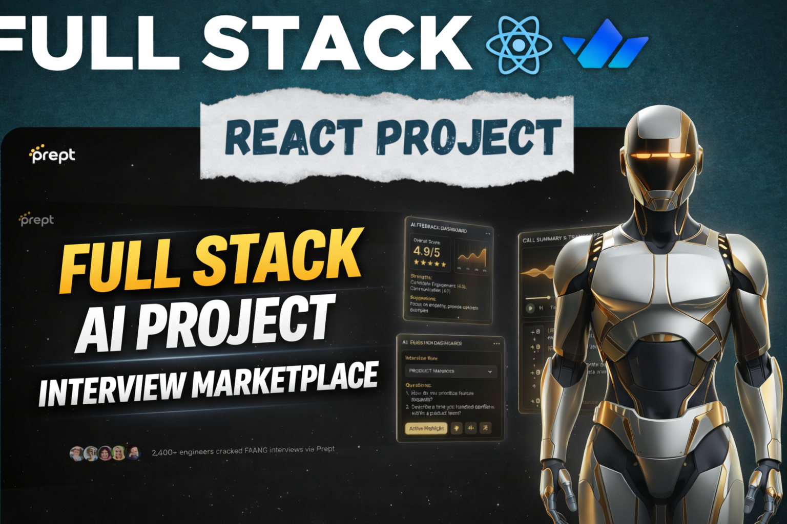

# PrepT - Advanced AI-Powered Mock Interview Platform

PrepT is a comprehensive, production-ready marketplace that connects job seekers (Interviewees) with industry experts (Interviewers) for high-quality mock interviews. Built with Next.js 14, PrepT leverages cutting-edge technology including real-time video streaming, AI-powered post-interview feedback, automated credit-based settlements, and a robust referral engine.

## 🚀 Key Features

### For Job Seekers (Interviewees)
* **Expert Discovery**: Explore a rich directory of vetted interviewers from top tech companies. Filter by domain including Frontend, Backend, System Design, DSA, Behavioral, and Mobile.
* **Credit-Based Booking System**: Purchase or earn credits to book tailored 45-minute sessions. Different interviewers can dynamically set their own credit rates.
* **Seamless Video Calls**: Integrated with Stream Video for flawless, low-latency, and recorded 1:1 interview sessions right in the browser.
* **AI-Generated Summary & Feedback**: Our AI analyzes your exact conversational transcript to generate deep, actionable feedback across Technical, Communication, and Problem-Solving metrics.
* **Review & Rating System**: Rate your experience post-call to help maintain the quality of the marketplace.

### For Industry Experts (Interviewers)
* **Custom Profiles & Dynamic Pricing**: Set your own rate (e.g., 2 credits per session), define your availability, update your bio, and proudly display your past work experience.
* **Interviewer Dashboard**: Track your upcoming schedule, view past sessions, and manage incoming requests seamlessly with single-click Accept/Reject choices.
* **Automated Earnings & Smart Escrow**: The platform holds interviewee credits in escrow until the session successfully concludes. Our intelligent settlement engine analyzes connection presence to prevent fraud and handle "No-Shows" automatically. Total earnings are instantly deposited into your internal ledger.
* **Rapid Cash Withdrawals**: Easily withdraw your `creditBalance` for real fiat to PayPal, Bank Transfer, or UPI minus a standard platform fee.

### Global Platform Features
* **Smart Referral Engine**: Users can share their unique referral links. When a referred friend completes their first session, Interviewees get bonus credits, and Interviewers earn direct withdrawal balances.
* **Real-time Notifications**: Fully integrated transactional emails via Resend to notify users of booking approvals, upcoming call links, and withdrawal lifecycle updates.
* **Enterprise Security**: Protected by Clerk Authentication and state-of-the-art routing middleware, augmented by Arcjet to securely rate-limit requests, block bots, and harden endpoints.

## 🛠 Tech Stack

* **Framework**: Next.js 14 (App Router)
* **Language**: JavaScript/React
* **Database**: PostgreSQL (Hosted on Supabase)
* **ORM**: Prisma
* **Authentication**: Clerk
* **Video Infrastructure**: Stream Video SDK
* **Email Provider**: Resend & React Email
* **Security & Rate Limiting**: Arcjet
* **UI & Styling**: Tailwind CSS, Shadcn UI, Framer Motion, Lucide Icons

## ⚙️ Local Development

1. **Clone & Install Dependencies**
   ```bash
   npm install
   ```

2. **Environment Variables**
   Ensure your `.env` is populated with the following keys:
   * Next.js App URL
   * Clerk Keys (`NEXT_PUBLIC_CLERK_PUBLISHABLE_KEY`, `CLERK_SECRET_KEY`)
   * Prisma Database URL (`DATABASE_URL`, `DIRECT_URL`)
   * Stream Video Keys (`NEXT_PUBLIC_STREAM_API_KEY`, `STREAM_SECRET_KEY`)
   * Resend API Key (`RESEND_API_KEY`)
   * Arcjet Key (`ARCJET_KEY`)

3. **Database Setup**
   ```bash
   npx prisma generate
   npx prisma db push
   ```

4. **Run Development Server**
   ```bash
   npm run dev
   ```

5. **Webhooks Setup (Important)**
   In order for automated settlement to trigger locally, you must tunnel your local development environment using tools like ngrok or the Stream CLI so that Stream can push `call.ended` events to your `/api/webhooks/stream` route.
